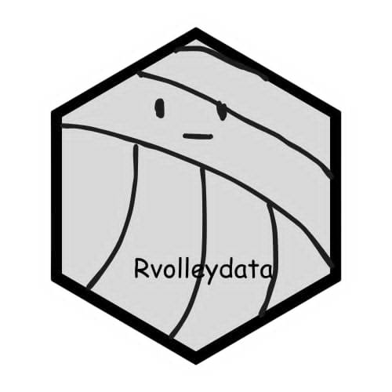

<!-- README.md is generated from README.Rmd. Please edit that file -->

# rvolleydata <a href="https://awosoga.github.io/rvolleydata/"></a>

badges: start

[](https://github.com/awosoga/rvolleydata/actions/workflows/R-CMD-check.yaml)
[](https://github.com/awosoga/rvolleydata)
[](https://lifecycle.r-lib.org/articles/stages.html#stable)

badges: end

The goal of rvolleydata is to help people access clean and tidy data
from [League One Volleyball Pro (LOVB)](https://www.lovb.com/),
[Athletes Unlimited Pro Volleyball
(AUPVB)](https://auprosports.com/volleyball/), and [Major League
Volleyball and Pro Volleyball Federation
(MLV)](https://provolleyball.com/) leagues.

## Installation

You can install the CRAN version of
[**`rvolleydata`**](https://CRAN.R-project.org/package=rvolleydata)
with:

``` r
install.packages("rvolleydata")
```

You can install the development version of rvolleydata from
[GitHub](https://github.com/awosoga/rvolleydata) with:

``` r
# install.packages("devtools")
devtools::isntall_github("awosoga/rvolleydata")
```

## Usage

Please refer to the [package
vignette](https://awosoga.github.io/rvolleydata/articles/how-to-use-rvolleydata)
for more information on how to use this library.
